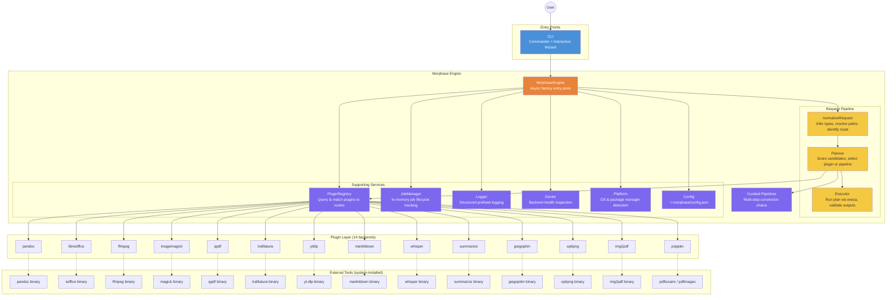
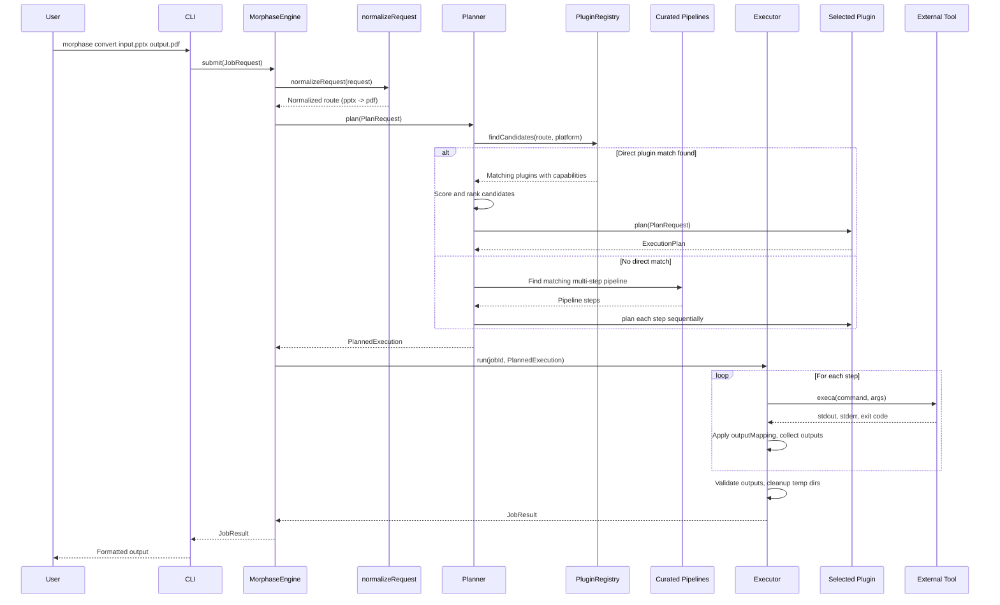
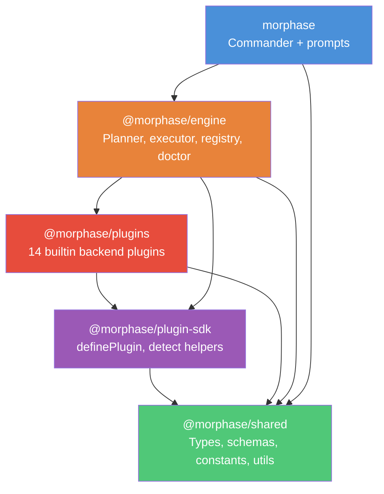
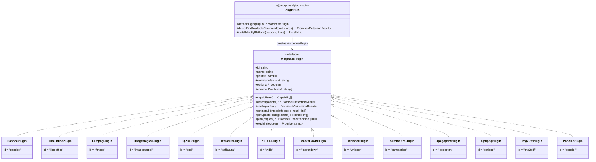
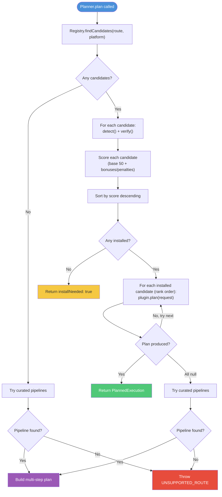
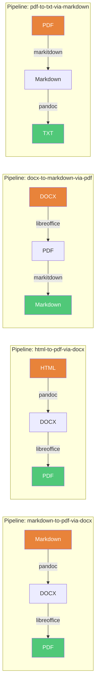
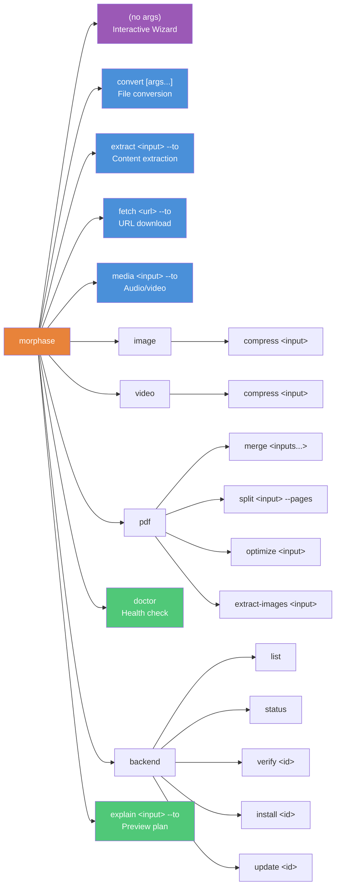

# Morphase Architecture Diagrams

## High-Level System Overview

## Request Lifecycle (Sequence)

## Monorepo Package Dependencies

## Plugin Interface

## Candidate Scoring & Planning

## Multi-Step Pipelines

## CLI Command Tree

