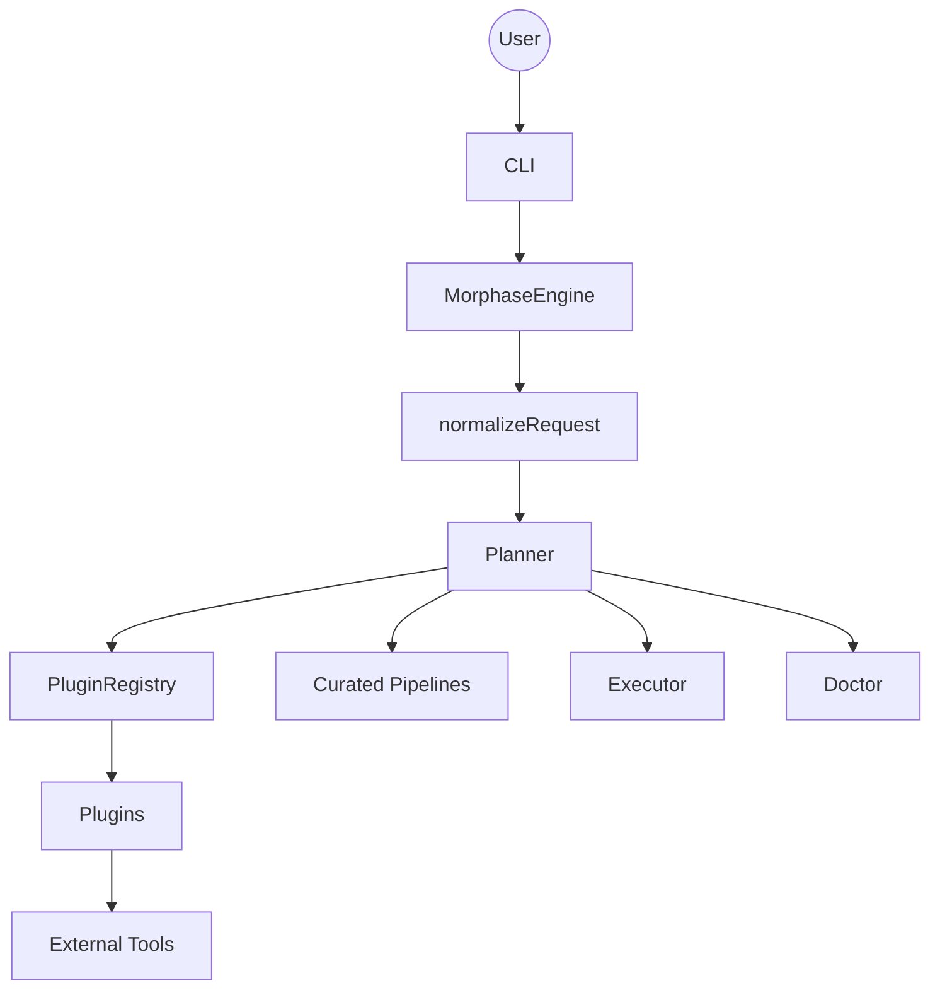

# Architecture

This document explains how Morphase is structured today: how requests are normalized, how backends are selected, how plans are executed, and how install guidance is generated.

## What Morphase is

Morphase is a CLI conversion router.

It does not convert files itself. Instead, it:

1. understands a request such as `pptx -> pdf` or `pdf split`,
2. finds plugins that can handle that route,
3. prefers an installed and healthy backend,
4. builds an execution plan, and
5. runs external tools such as `pandoc`, `soffice`, `ffmpeg`, or `qpdf`.

Core file routes are local. Network-backed routes are explicit.

## Monorepo layout

```text
morphase/
  apps/
    cli/            # Commander-based CLI and interactive wizard
  packages/
    shared/         # Types, schemas, route constants, install helpers
    plugin-sdk/     # Minimal SDK helpers for plugin authors
    plugins/        # Builtin plugins and shared plugin helpers
    engine/         # Planner, executor, doctor, platform detection
  docs/
  tests/
```

Dependency flow:

```text
@morphase/shared
    ^
@morphase/plugin-sdk
    ^
@morphase/plugins
    ^
@morphase/engine
    ^
morphase CLI
```

## High-level flow



## Request lifecycle

Given:

```bash
morphase convert deck.pptx deck.pdf
```

Morphase does the following:

1. The CLI builds a `JobRequest`.
2. `normalizeRequest()` resolves paths, infers kinds, validates inputs, and determines the route.
3. The planner asks the registry for plugins whose capabilities match the route on the current platform.
4. Each candidate is detected and verified.
5. Candidates are scored using route preference, install status, verification state, quality, and offline requirements.
6. The first installed, verified, version-supported plugin that can produce a concrete plan wins.
7. If no direct plugin can build a plan, Morphase tries a curated pipeline.
8. The executor runs the plan, validates outputs, and returns a `JobResult`.

If the only installed candidates are unhealthy, Morphase does not run them. It returns a structured `BACKEND_UNHEALTHY` error instead.

## Core engine components

### `MorphaseEngine`

`MorphaseEngine.create()` builds the runtime engine:

- loads config from `~/.morphase/config.json`
- detects the runtime environment
- registers builtin plugins
- constructs the planner, executor, doctor, logger, and job manager

### `PluginRegistry`

The registry stores plugins and exposes:

- `list()` for display order
- `get(id)` for backend lookup
- `capabilities()` for a flattened capability list
- `findCandidates(route, platform)` for route matching

### `Planner`

The planner takes a normalized `PlanRequest` and returns a `PlannedExecution`.

Candidate scoring currently considers:

| Factor | Effect |
| --- | --- |
| Exact route match | base eligibility |
| Preferred backend for the route | positive score |
| Installed backend | positive score |
| Verified backend | positive score |
| Offline support when requested | positive score |
| Quality (`high`, `medium`, `best_effort`) | score adjustment |
| Network-only route during offline mode | rejected |
| Installed but unhealthy | score penalty |
| Installed but below `minimumVersion` | larger score penalty |

Selection rules:

- Missing backends can still appear as install candidates.
- Execution only uses candidates that are installed, verified, and version-supported.
- Warnings from the selected backend are preserved in the planned result.
- If no direct plan exists, curated pipelines are considered.
- If only unhealthy installed candidates remain, the planner fails clearly instead of running them.

### `Executor`

The executor runs one or more `PlannedStep`s via `execa`:

- captures stdout/stderr
- writes stdout to files when a plan uses `stdoutFile`
- applies `outputMapping` for tools that emit their own filenames
- validates expected outputs
- collects outputs from directories when needed
- cleans temp directories unless `--debug` or `keepTemp` is set
- enriches known backend failures into user-facing causes and fixes

`--dry-run` still goes through planning, but execution is skipped and the CLI reports a planned result instead of output files.

### `Doctor`

The doctor inspects plugins by combining:

- runtime environment,
- `detect()` output,
- `verify()` output,
- minimum-version checks, and
- resolved install/update hints.

CLI surfaces built on top of the doctor:

- `morphase doctor`
- `morphase backend list`
- `morphase backend status`
- `morphase backend verify <id>`
- `morphase backend install <id>`
- `morphase backend update <id>`

### `Platform`

Platform handling lives in `packages/engine/src/platform/platform.ts`.

It detects:

- coarse OS: `macos`, `windows`, `linux`, `bsd`
- Linux distro family from `/etc/os-release`
- BSD flavor where relevant
- available package managers in environment-specific priority order

That runtime model feeds install hint resolution and doctor output.

## Plugin model

Every plugin implements `MorphasePlugin`:

```ts
interface MorphasePlugin {
  id: string;
  name: string;
  priority: number;
  minimumVersion?: string;
  optional?: boolean;
  commonProblems?: string[];

  capabilities(): Capability[];
  detect(platform: Platform): Promise<DetectionResult>;
  verify(platform: Platform): Promise<VerificationResult>;
  getInstallStrategies(): InstallStrategy[];
  getUpdateStrategies?(): InstallStrategy[];
  plan(request: PlanRequest): Promise<ExecutionPlan | null>;
  explain(request: PlanRequest): Promise<string>;
}
```

Responsibilities:

- `capabilities()` describes what a backend can do.
- `detect()` answers whether the tool exists.
- `verify()` checks whether it is actually ready to run.
- `getInstallStrategies()` / `getUpdateStrategies()` declare install guidance.
- `plan()` returns a structured execution plan for a route.
- `explain()` provides human-readable backend reasoning.

Plugins do not make global routing decisions. They declare capabilities and build plans; the planner decides which plugin runs.

## Capabilities, routes, and plans

Capabilities and routes are intentionally separate:

- `Capability.kind` is backend-facing: `convert`, `extract`, `fetch`, or `transform`
- `Route.kind` is planning-facing: `conversion` or `operation`

That split lets multiple backend styles map into one user-facing route model.

Examples:

- `pandoc` declares `convert` capabilities.
- `trafilatura` declares `fetch` capabilities.
- `jpegoptim` declares `transform` with `operation: "compress"`.

`plan()` always receives a normalized `PlanRequest` that already includes the route and resolved paths.

## Install guidance model

Morphase does not hardcode one command per OS in the CLI. Instead:

1. each plugin declares install and update strategies,
2. the runtime environment is detected at startup,
3. shared install helpers choose the best matching strategy, and
4. the CLI prints that resolved hint.

Important behavior:

- package-manager commands are structured as `{ file, args[] }`, not shell strings
- wrong-manager avoidance is enforced through runtime matching
- manual fallbacks are first-class and intentionally shown when no compatible manager matches
- `backend install --run` and `backend update --run` only execute when delegation is explicitly enabled and the terminal is interactive

See [platform-and-package-manager-handling.md](platform-and-package-manager-handling.md) for the full details.

## Curated pipelines

When no single backend can satisfy a route directly, Morphase can chain plugins.

Current curated pipelines:

| Pipeline | Steps |
| --- | --- |
| `markdown-to-pdf-via-docx` | `pandoc` (`markdown -> docx`) -> `libreoffice` (`docx -> pdf`) |
| `html-to-pdf-via-docx` | `pandoc` (`html -> docx`) -> `libreoffice` (`docx -> pdf`) |
| `docx-to-markdown-via-pdf` | `libreoffice` (`docx -> pdf`) -> `markitdown` (`pdf -> markdown`) |
| `pdf-to-txt-via-markdown` | `markitdown` (`pdf -> markdown`) -> `pandoc` (`markdown -> txt`) |

Pipelines run inside a shared temp root and pass intermediate files from one step to the next.

## Error model

Morphase throws structured runtime errors rather than raw stack traces.

Common error codes include:

- `INVALID_INPUT`
- `OUTPUT_EXISTS`
- `UNSUPPORTED_ROUTE`
- `BACKEND_NOT_INSTALLED`
- `BACKEND_UNHEALTHY`
- `BACKEND_EXECUTION_FAILED`
- `OUTPUT_NOT_PRODUCED`
- `NETWORK_REQUIRED`

Each error can include:

- `message`
- `likelyCause`
- `suggestedFixes`
- `backendId`
- raw stdout/stderr for debugging

The CLI formatter turns those fields into actionable output.

## Configuration

Morphase reads `~/.morphase/config.json` and validates it with Zod.

Current config shape:

```json
{
  "offlineOnly": false,
  "preferredBackends": {},
  "debug": false,
  "allowPackageManagerDelegation": false
}
```

Notable flags:

- `offlineOnly`: rejects network-backed candidates
- `preferredBackends`: route-to-backend overrides
- `debug`: enables more verbose logging and temp retention behavior
- `allowPackageManagerDelegation`: gates `backend install --run` and `backend update --run`

## Testing focus

The test suite covers the parts of the system most likely to regress:

- runtime environment detection
- package-manager ordering and strategy resolution
- plugin strategy validation
- planner selection and fallback behavior
- normalization and path safety
- executor output handling
- CLI exit codes and formatting-sensitive flows

## Related docs

- [Route matrix](route-matrix.md)
- [Plugin authoring](plugin-authoring.md)
- [Platform and package manager handling](platform-and-package-manager-handling.md)
