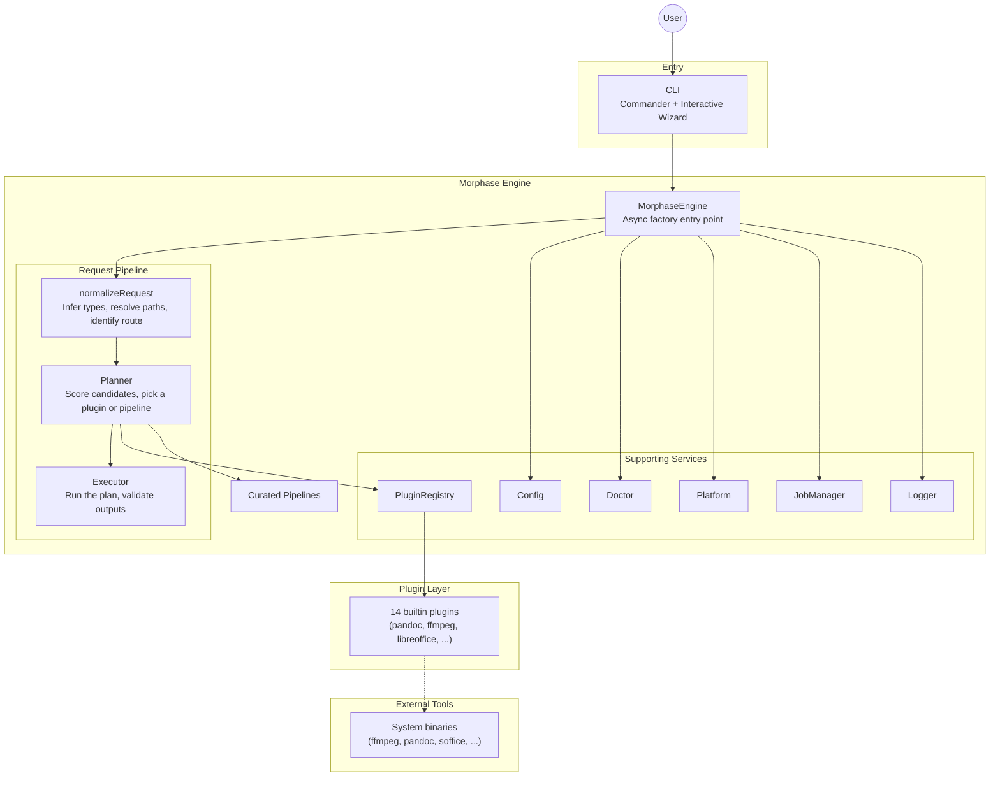
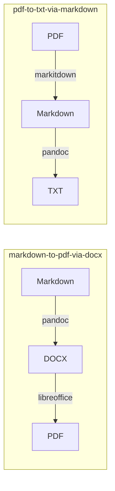

# Architecture

This document is for people who want to understand how Morphase is put together — contributors, plugin authors, or anyone debugging a routing decision.

The first half is written for newcomers. Later sections go deeper into the engine internals.

## What Morphase is

Morphase is a **conversion router**. Given a file (or URL) and a target format, it picks an installed external tool, builds a plan, runs it, and validates the output.

It is a CLI only. Core routes run entirely on your machine and don't require a background process or network connection.

## Core design principle

> **One shared engine, a thin CLI, pluggable backends.**

- The **CLI** is a small Commander-based front end. It collects a request and displays results.
- The **engine** owns routing, planning, execution, diagnostics, and job tracking.
- **Plugins** isolate backend-specific behavior. Each plugin knows how to detect one external tool, describe what it can do, and build an `ExecutionPlan` for a given request.
- **Shared types and schemas** keep the public surface consistent across packages.

Morphase itself never performs a conversion. It spawns external binaries like `ffmpeg`, `pandoc`, or `libreoffice` and hands back the results.

## High-level view



## Request lifecycle in plain English

When you run `morphase convert deck.pptx deck.pdf`:

1. **Collect.** The CLI parses arguments into a `JobRequest`.
2. **Normalize.** The engine resolves paths, infers the input kind (`pptx`) from the extension, and identifies the route (`pptx → pdf`).
3. **Find candidates.** The plugin registry returns every plugin capable of that route on the current OS (`libreoffice`, in this case).
4. **Score.** Each candidate gets a numeric score based on install status, health, quality, offline capability, and user preferences.
5. **Plan.** The highest-scoring installed plugin produces an `ExecutionPlan` — a command, args, temp dirs, expected outputs.
6. **Execute.** The executor spawns the tool via `execa`, captures stdout/stderr, applies any output renames, validates the outputs exist, and cleans up temp directories.
7. **Return.** A `JobResult` flows back to the CLI, which prints a human-readable summary.

If no plugin can handle a route directly, the planner falls back to **curated pipelines** that chain plugins (e.g. Markdown → DOCX via Pandoc, then DOCX → PDF via LibreOffice).

If a plugin is missing, the engine throws a structured error with install hints for the current OS, not a raw command-not-found.

## Monorepo layout

Morphase is a pnpm workspace.

```
morphase/
  apps/
    cli/                    # Interactive and direct CLI (commander + prompts)
  packages/
    shared/                 # Types, schemas, constants, utilities
    plugin-sdk/             # Plugin authoring helpers
    plugins/                # All builtin backend plugins
    engine/                 # Routing, planning, execution, doctor
  docs/
  tests/
```

Dependency direction (leaves at the top):

```
@morphase/shared
    ^
@morphase/plugin-sdk
    ^
@morphase/plugins
    ^
@morphase/engine
    ^
morphase  (the CLI)
```

Key external dependencies:

- **zod** — config and job-request validation
- **execa** — process spawning
- **commander** — CLI argument parsing
- **prompts** — interactive wizard

## Key engine components

The engine is constructed via the async factory `MorphaseEngine.create()`:

```
MorphaseEngine.create()
  ├── loadMorphaseConfig()           // ~/.morphase/config.json (falls back to defaults)
  ├── new PluginRegistry(plugins)    // Registers all builtin plugins
  ├── new Planner(registry, config)
  ├── new Logger(config.debug)
  ├── new Executor(logger)
  └── new Doctor()
```

### Plugin registry

Holds all registered plugins and answers queries:

- `list()` — plugins sorted by descending priority
- `get(id)` — lookup by ID
- `capabilities()` — flattened capability list
- `findCandidates(route, platform)` — plugins whose capabilities match a route on the current OS

### Planner

Takes a normalized `PlanRequest` and returns a `PlannedExecution`.

1. **Normalize the request** (`normalize-request.ts`): resolve paths, infer resource kind, derive a default output path if none was given, and identify the route.
2. **Score candidates**:

   | Factor                                   | Score     |
   | ---------------------------------------- | --------- |
   | Base (exact route match)                 | +50       |
   | Preferred for route (config or defaults) | +20       |
   | Plugin installed                         | +15       |
   | Plugin verified healthy                  | +10       |
   | Offline support when offline requested   | +15       |
   | High-quality route                       | +10       |
   | Medium-quality route                     | +5        |
   | Best-effort route                        | −20       |
   | Installed but unhealthy                  | −30       |
   | Network required when offline requested  | rejected  |

3. **Build a plan**: try each installed candidate in rank order; the first non-null `plan()` wins. Fall back to curated pipelines if none succeed. Throw `UNSUPPORTED_ROUTE` if there is no path forward.
4. **Generate an equivalent command** (e.g. `morphase convert deck.pptx deck.pdf`) so the CLI can echo what it would run.

### Executor

Runs the planned steps and validates the result:

1. If `dryRun`, log commands without executing.
2. For each step: spawn the process via `execa` (with `reject: false`), capture logs, apply `outputMapping` (rename generated files), collect `expectedOutputs`.
3. Validate that expected outputs actually exist on disk.
4. Clean up temp directories (unless `--debug` or `--keep-temp`).
5. Enrich known failure patterns in stderr (e.g. yt-dlp "sign in" → YouTube blocking; FFmpeg "does not contain any stream" → missing audio) into actionable `likelyCause` / `suggestedFixes`.

### Doctor

For each plugin, calls `detect()` and `verify()` and assembles a `BackendDoctorReport`: installed status, detected version, minimum version, verification issues, install and update hints for the current platform, and known common problems.

Exposed as `morphase doctor`, `morphase backend list`, `morphase backend verify <id>`, `morphase backend install <id>`, and `morphase backend update <id>`.

### Job manager

Every operation is tracked as a job with a UUID in an in-memory `Map<string, JobRecord>`. Lifecycle: `queued` → `planned` → `running` → `success | failed | cancelled`.

### Platform

Isolates OS-specific behavior:

- `detectPlatform()` — coarse OS detection (`macos` / `windows` / `linux`)
- `detectLinuxDistro()` — distro-family detection from `/etc/os-release`
- `detectPackageManagers()` — detects available package managers in priority order for the environment
- `detectRuntimeEnvironment()` — combines OS, distro, and detected package managers into a single runtime model
- `homeDirectory()` — config resolution helper

### Configuration

Loaded from `~/.morphase/config.json`, validated with Zod:

```ts
{
  offlineOnly: false,                  // Reject network-backed backends
  preferredBackends: {},               // Override route → plugin preferences
  debug: false,                        // Enable debug logging
  allowPackageManagerDelegation: false // Allow `backend install --run` to execute
}
```

If the file is missing, defaults are used. If it exists but is invalid, loading fails closed with an error.

## Plugin model

Every plugin implements the `MorphasePlugin` interface:

```ts
interface MorphasePlugin {
  id: string;
  name: string;
  priority: number;
  minimumVersion?: string;
  optional?: boolean;
  commonProblems?: string[];

  capabilities(): Capability[];
  detect(platform: Platform): Promise<DetectionResult>;
  verify(platform: Platform): Promise<VerificationResult>;
  getInstallStrategies(): InstallStrategy[];
  getUpdateStrategies?(): InstallStrategy[];
  plan(request: PlanRequest): Promise<ExecutionPlan | null>;
  explain(request: PlanRequest): Promise<string>;
}
```

Plugins are stateless factories for execution plans. They do not perform conversions themselves.

For the full contract, SDK helpers, and a worked example, see [plugin-authoring.md](plugin-authoring.md).

## Pipelines

When no single plugin can handle a route, Morphase can chain plugins via curated pipelines (`packages/engine/src/planner/pipelines.ts`). Each step runs in a shared temp directory; intermediate outputs feed the next step.



Current pipelines:

| Pipeline ID                 | Steps                                               |
| --------------------------- | --------------------------------------------------- |
| `markdown-to-pdf-via-docx`  | pandoc (md→docx) → libreoffice (docx→pdf)           |
| `html-to-pdf-via-docx`      | pandoc (html→docx) → libreoffice (docx→pdf)         |
| `docx-to-markdown-via-pdf`  | libreoffice (docx→pdf) → markitdown (pdf→md)        |
| `pdf-to-txt-via-markdown`   | markitdown (pdf→md) → pandoc (md→txt)               |

## Error handling, doctor, and platform support

Morphase owns **diagnosis**, not repair. When something goes wrong, it tries to:

1. **Say what failed** — a machine-readable error code and message.
2. **Say why** — `likelyCause` explains the probable reason.
3. **Say how to fix it** — `suggestedFixes` gives actionable steps.
4. **Offer alternatives** — `fallbacks` lists other backends that could handle the route.

Error codes include: `INVALID_INPUT`, `OUTPUT_EXISTS`, `UNSUPPORTED_ROUTE`, `BACKEND_NOT_INSTALLED`, `BACKEND_EXECUTION_FAILED`, `OUTPUT_NOT_PRODUCED`, `NETWORK_REQUIRED`.

All errors are thrown as `MorphaseRuntimeError`, wrapping a structured `MorphaseError` with `code`, `message`, `likelyCause`, `suggestedFixes`, `backendId`, and raw stdout/stderr for debugging.

Morphase provides environment-aware install guidance. When a backend is missing, the engine resolves install strategies against the detected runtime environment and shows the right command for the user's platform and package manager. If no matching strategy exists, it falls back to honest manual guidance instead of printing a wrong command.

See [platform-and-package-manager-handling.md](platform-and-package-manager-handling.md) for the full detection and resolution details.

Support tiers for install guidance:

| Tier | Description |
|------|-------------|
| **Well-supported** | Detected package manager has a strategy for the plugin. Morphase prints the exact command. |
| **Best effort** | Plugin has strategies but not for the user's package manager. Falls back to manual guidance. |
| **Manual only** | No package manager detected or no strategies match. Clear manual instructions. |

---

## Deeper internals

The sections below are useful if you're modifying the engine itself.

### Domain model

#### Resource kinds

Morphase reasons about normalized resource kinds, not raw extensions. Defined as a const array in `@morphase/shared`:

`markdown`, `html`, `docx`, `pptx`, `xlsx`, `odt`, `ods`, `odp`, `pdf`, `txt`, `jpg`, `png`, `webp`, `heic`, `mp3`, `wav`, `mp4`, `mov`, `mkv`, `url`, `youtube-url`, `media-url`, `subtitle`, `transcript`.

`inferResourceKind` checks, in order: YouTube hostname, known media hosts (Instagram, TikTok, X, Reddit, …), any HTTP(S) URL, then file extension.

#### Routes

```ts
type Route =
  | { kind: "conversion"; from: ResourceKind; to: ResourceKind }
  | { kind: "operation";  resource: ResourceKind; action: string };
```

Route keys: `"pptx->pdf"` for conversions, `"pdf:merge"` for operations.

#### Core types

| Type               | Purpose                                                                          |
| ------------------ | -------------------------------------------------------------------------------- |
| `JobRequest`       | User-facing: input, from/to, operation, output, options, backend preference      |
| `PlanRequest`      | Internal normalized request with resolved route, platform, `offlineOnly`         |
| `ExecutionPlan`    | What to run: command, args, env, cwd, tempDirs, expectedOutputs, outputMapping   |
| `PlannedExecution` | Full plan result: selected plugin, explanation, warnings, steps, fallbacks       |
| `JobResult`        | Final result: jobId, status, outputPaths, logs, warnings, error                  |
| `JobRecord`        | In-memory job state                                                              |
| `MorphaseError`    | Structured error: code, message, likelyCause, suggestedFixes, rawStdout/Stderr   |

### Execution plan structure

```ts
{
  command: string;
  args: string[];
  env?: Record<string, string>;
  cwd?: string;
  tempDirs?: string[];
  expectedOutputs?: string[];
  outputMapping?: { source: string; target: string }[];
  stdoutFile?: string;
  timeoutMs?: number;
  notes?: string[];
}
```

- `outputMapping` handles backends (LibreOffice, yt-dlp) that generate output with their own naming conventions — the executor renames those files to the expected path.
- `stdoutFile` captures stdout to a file (used by trafilatura, summarize).
- Commands and args are passed separately to `execa`; there is no shell concatenation.

### Route preferences

Preferences come from three sources, highest priority first:

1. The `--backend` CLI flag (explicit user choice).
2. `preferredBackends` in `~/.morphase/config.json`.
3. The built-in `ROUTE_PREFERENCES` map in `packages/shared/src/constants/routes.ts`.

### Builtin plugin matrix

| Plugin       | ID            | Priority | External tool              |
| ------------ | ------------- | -------- | -------------------------- |
| Pandoc       | `pandoc`      | 95       | `pandoc`                   |
| LibreOffice  | `libreoffice` | 100      | `soffice`                  |
| FFmpeg       | `ffmpeg`      | 100      | `ffmpeg`                   |
| ImageMagick  | `imagemagick` | 100      | `magick` / `convert`       |
| qpdf         | `qpdf`        | 100      | `qpdf`                     |
| Trafilatura  | `trafilatura` | 90       | `trafilatura`              |
| MarkItDown   | `markitdown`  | 80       | `markitdown`               |
| yt-dlp       | `ytdlp`       | 60       | `yt-dlp`                   |
| Whisper      | `whisper`     | 65       | `whisper`                  |
| summarize    | `summarize`   | 70       | `summarize`                |
| jpegoptim    | `jpegoptim`   | 100      | `jpegoptim`                |
| optipng      | `optipng`     | 95       | `optipng`                  |
| img2pdf      | `img2pdf`     | 100      | `img2pdf`                  |
| Poppler      | `poppler`     | 100      | `pdftocairo` / `pdfimages` |

For the full capability breakdown per route, see [route-matrix.md](route-matrix.md).

### Testing

Tests live under `tests/` and use Vitest:

| Test file                         | What it covers                                                     |
| --------------------------------- | ------------------------------------------------------------------ |
| `tests/planner.test.ts`           | Scoring, candidate selection, preferences, pipeline fallback       |
| `tests/plugins.test.ts`           | Plugin metadata, capability declarations, detect/verify behavior   |
| `tests/plugin-validation.test.ts` | Strategy validation, manual fallback coverage, OS scoping checks   |
| `tests/install-guidance.test.ts`  | Strategy selection, CLI output, buildInstallStrategies, auto-install |
| `tests/normalize-request.test.ts` | Path resolution and resource-kind inference                        |
| `tests/runtime-environment.test.ts`| OS, distro, and package manager detection                         |
| `tests/youtube.test.ts`           | YouTube URL detection and routing                                  |
| `tests/image-pdf.test.ts`         | Image ↔ PDF route handling                                         |
| `tests/cli.test.ts`               | CLI exit codes for error cases                                     |
| `tests/config.test.ts`            | Configuration loading and validation                               |
| `tests/executor.test.ts`          | Error enrichment patterns                                          |

Dev commands:

```bash
pnpm build       # Build all packages (tsup)
pnpm typecheck   # TypeScript across all packages
pnpm test        # Run vitest
pnpm test:watch  # Vitest watch mode
pnpm dev         # Run CLI via tsx
```

### Security posture

- Local-first by default; no network requirement for core routes.
- Network-backed plugins (yt-dlp, trafilatura, summarize) are clearly disclosed and easy to exclude with `--offline`.
- Plugins do not mutate system state without explicit user confirmation (`backend install --run` is gated behind a config flag).
- Commands and args are always passed as separate arrays to `execa` — no shell injection.
- `--debug` and `--keep-temp` are opt-in for troubleshooting and never default on.
